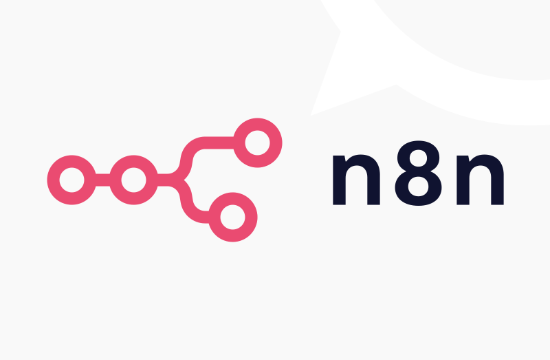

# 🚀 n8n Workflows  

## ⚡ My Take on n8n — Automation Supercharged by Real Software Engineering

n8n is one of the most flexible workflow automation tools available today.  
But here is the truth:

> **n8n by itself is simple — but when combined with real software engineering, it becomes insanely powerful.**

This document explains:
- How n8n works  
- Why it’s not meant to replace engineering  
- Why engineers who adopt n8n gain a massive advantage  
- How n8n + code + AI + databases = production-grade automation  
- How these workflows (crypto analysis + RAG chatbot) fit into that philosophy  

---

## 🧠 What n8n *Is*  
n8n is:

- A **workflow orchestrator**
- A **visual automation builder**
- A **connector hub** for APIs
- A powerful **glue layer** between services
- Extensible with **JavaScript**, **Python**, **databases**, and **AI models**

It makes repetitive tasks easy:
- Fetch data  
- Transform it  
- Call APIs  
- Store results  
- Trigger downstream logic  

Think of it as:

> **Zapier for engineers – but open-source, programmable, and infinitely extendable.**

---

## 🛑 What n8n *Is Not*
n8n is **not**:

- A replacement for real backends  
- A full programming language  
- A complex data pipeline engine like Airflow  
- A standalone AI reasoning system  
- A system that guarantees strict scalability on its own

n8n excels **only when paired with proper engineering foundations**.

Without those foundations, workflows become:
- Hard to maintain  
- Hard to scale  
- Hard to debug  
- Easy to break  

---

## 🚀 Why n8n Becomes Ultra-Powerful with Engineering

Here’s where n8n shines:

### ✓ **n8n + Databases (Postgres, pgvector, Redis)**  
Store long-term, structured data.  
Build retrieval systems.  
Track stateful workflows.

### ✓ **n8n + Python or Node.js**  
Complex algorithms?  
ML models?  
Trading logic?  
Backtesting?  
Custom transformations?

Drop a code node and you’re done.

### ✓ **n8n + AI Models (Ollama, OpenAI, Anthropic)**  
AI becomes another tool in your pipeline.  
Perfect for:
- RAG chatbots  
- Decision engines  
- Document analysis  
- Error recovery  
- Data classification

### ✓ **n8n + APIs**  
You can automate *anything* that exposes an API:
- Exchange tickers  
- Trading platforms  
- CRM systems  
- Payments  
- Telegram, WhatsApp, Slack  
- File storage

### ✓ **n8n + Cron / Triggers**  
Pure automation.  
No server code needed.  
Just orchestrate it visually.

---

## 🔧 n8n Makes the Best Engineers Even Better

n8n does **not** replace developers —  
it **amplifies** them.

With engineering knowledge:
- You know how to structure logic  
- You know how to write efficient JS/Python nodes  
- You can safely integrate databases  
- You can design fault-tolerant workflows  
- You can debug edge cases  
- You can add AI agents as step-by-step reasoning tools  
- You can build real products extremely fast

> **n8n is a force multiplier. The better your engineering skills, the more powerful n8n becomes.**

---

## 📦 Example Projects in This Repository

### 📁 1. `ollama-postgres-rag-chatbot/`
A complete Retrieval-Augmented Generation chatbot powered by:
- Ollama embedding model  
- Ollama chat model  
- PostgreSQL pgvector search  
- n8n automation logic  
- Custom JavaScript transformations  

This workflow is used to create chat systems that answer questions based on stored documents.

### 📁 2. `basic-crypto-ticker-analysis/`
A multi-stage trading-analysis automation:
- Fetch crypto tickers via API  
- Python-based technical analysis (ATR, RSI, EMA, etc.)  
- AI agent for reasoning and decision-making  
- Database logging of trades, portfolio, and history  

A real-world example of how **n8n + code + AI** outperform n8n alone.

---

## 🧩 Best Practices for Professional n8n Workflows

### 1. Use real databases  
Never store large data inside workflow variables.

### 2. Offload complex logic to Python or JS  
Keep workflows readable.

### 3. Version-control everything  
Export workflows, write docs, and commit them.

### 4. Use AI as a reasoning step, not the whole pipeline  
AI should assist engineering logic, not replace it.

### 5. Test workflows locally before running in production  
Use staging databases and sandbox APIs.

---

## 🎯 Final Thoughts

n8n is NOT meant to be a standalone magic automation tool.  
But with:
- real programming skills,  
- real data models,  
- real databases,  
- AI models like Ollama, and  
- good engineering practices…

it becomes:

> **One of the fastest ways to build real, production-grade automation and AI systems.**

This repo shows exactly that philosophy in action.

---

## 📑 License  
Each workflow folder contains its own MIT license.